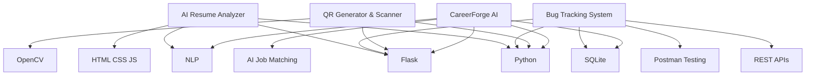

# Hi 👋 I'm Madhavi Chittimalla

### AI & ML Student | Python • Flask • AI/ML • Web Development • Testing

 

---

## ✨ About Me

- 🎓 B.Tech CSE (AI & ML) Student at **SR University, Warangal**
- 💻 Interested in **AI/ML, Web Development, APIs, SQL & Testing**
- 🚀 Building projects using **Python, Flask, JavaScript & SQLite**
- 📚 Currently learning **React, Node.js, DSA & REST APIs**
- 💼 Open to **Internship and Full-Time Opportunities**
- ⭐ Passionate about solving real-world problems using technology

---

## 🛠️ Technical Skills

---

## 💻 Coding Focus

---

## 🚀 Project Ecosystem

---

## 🚀 Featured Projects

<table>
<tr>
<td width="50%">

### 🧠 [AI Resume Analyzer](https://github.com/Madhavi2233/AI-Resume-Analyzer)

✅ ATS Resume Score  
✅ Skill Matching  
✅ Missing Skills Detection  
✅ Resume Suggestions  

**Tech Stack:**  
Python, Flask, NLP, HTML, CSS, JavaScript

</td>

<td width="50%">

### 🐞 [Bug Tracking System](https://github.com/Madhavi2233/Bug-Tracking-System)

✅ Login/Register System  
✅ CRUD Operations  
✅ REST APIs  
✅ API Testing with Postman  

**Tech Stack:**  
Python, Flask, SQLite, Bootstrap

</td>
</tr>

<tr>
<td width="50%">

### 🔳 [QR Generator & Scanner](https://github.com/Madhavi2233/QR-Generator)

✅ Generate QR Codes  
✅ Scan QR Codes  
✅ OpenCV Integration  
✅ Flask Backend  

**Tech Stack:**  
Python, Flask, OpenCV

</td>

<td width="50%">

### 💼 CareerForge AI *(Building)*

✅ Resume Upload  
✅ AI Job Matching  
✅ Skill Gap Analysis  
✅ Application Tracker  

**Tech Stack:**  
Python, Flask, SQLite, JavaScript, NLP

</td>
</tr>
</table>

---

## 📜 Certifications

| Certification | Domain |
|---|---|
| AI & ML Internship – 1Stop | Artificial Intelligence |
| Python Programming | Programming |
| Web Development Fundamentals | Web Development |
| Project Management | Management |

---

## 🌐 Connect With Me

---

⭐ **Learning • Building • Growing** ⭐

